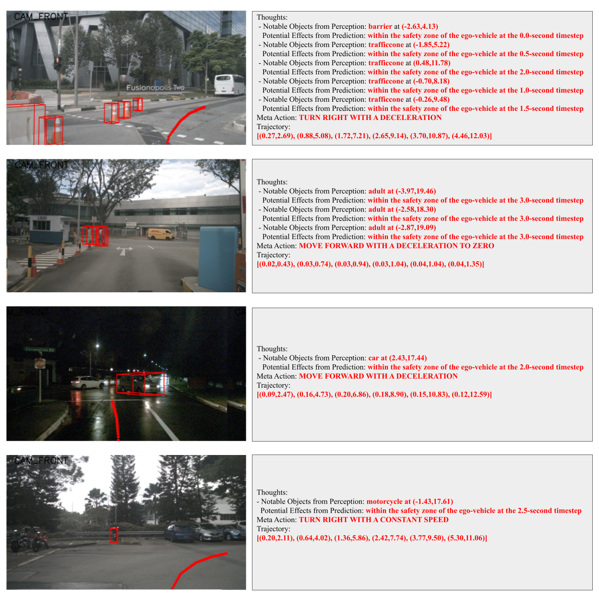

# GPT-Driver

This is a repo of our arXiv pre-print [GPT-Driver](https://arxiv.org/abs/2310.01415) [[Project Page](https://pointscoder.github.io/projects/gpt_driver/index.html)].

Note: Running GPT-Driver requires an [OpenAI API account](https://platform.openai.com/)  

Note: Evaluation Code is [here](https://drive.google.com/drive/folders/1NCqPtdK8agPi1q3sr9-8-vPdYj08OCAE?usp=sharing) for the open-loop motion planning performance on nuScenes. 

## Introduction

We present a simple yet effective approach that can transform the OpenAI GPT-3.5 model into a reliable motion planner for autonomous vehicles. Motion planning is a core challenge in autonomous driving, aiming to plan a driving trajectory that is safe and comfortable. Existing motion planners predominantly leverage heuristic methods to forecast driving trajectories, yet these approaches demonstrate insufficient generalization capabilities in the face of novel and unseen driving scenarios. In this paper, we propose a novel approach to motion planning that capitalizes on the strong reasoning capabilities and generalization potential inherent to Large Language Models (LLMs). The fundamental insight of our approach is the reformulation of motion planning as a language modeling problem, a perspective not previously explored. Specifically, we represent the planner inputs and outputs as language tokens, and leverage the LLM to generate driving trajectories through a language description of coordinate positions. Furthermore, we propose a novel prompting-reasoning-finetuning strategy to stimulate the numerical reasoning potential of the LLM. With this strategy, the LLM can describe highly precise trajectory coordinates and also its internal decision-making process in natural language. We evaluate our approach on the large-scale nuScenes dataset, and extensive experiments substantiate the effectiveness, generalization ability, and interpretability of our GPT-based motion planner.



## Installation
a. Clone this repository.
```shell
git clone https://github.com/PointsCoder/GPT-Driver.git
```

b. Install the dependent libraries as follows:

```
pip install -r requirements.txt 
```

## Data Preparation

a. We pre-cached the used information (detections, predictions, trajectories, etc.) from the nuScenes dataset (cached_nuscenes_info.pkl) and UniAD pretrained models (detection_motion_result_trainval.jsonl). The data can be downloaded at [Google Drive](https://drive.google.com/drive/folders/1hUb1dsaDUABbUKnhj63vQBi0n4AZaZyM?usp=sharing).

b. You can put the downloaded data here:
```
GPT-Driver
├── data
│   ├── cached_nuscenes_info.pkl
│   ├── detection_motion_result_trainval.jsonl
│   ├── split.json
├── gpt-driver
├── outputs
```

c. OpenAI requires submitting a json file that contains the prompts and answers for fine-tuning. To build this `train.json` file, run
```
python gpt-driver/create_data.py
```
You will get the `train.json` here:
```
GPT-Driver
├── data
│   ├── cached_nuscenes_info.pkl
│   ├── detection_motion_result_trainval.jsonl
│   ├── split.json
│   ├── train.json
├── gpt-driver
├── outputs
```

## Fine-Tuning via OpenAI API

a. To finetune your own model, you need to first register an [OpenAI API account](https://platform.openai.com/).

b. After registration, you can generate an API-key in your account settings. Here is an example:

```
openai.api_key = "sk-I**p"
```
You need to specify this key anywhere needed in the code. Please note that this is your own key and will be linked to your bill payment, so keep this confidential and do not distribute it to others!

c. To submitted a fine-tune job to OpenAI, you can use the following commands in your Python console:
```
import openai
openai.api_key = "sk-I**p"

# This will take some time for uploading train.json to the OpenAI server.
response = openai.File.create(file=open("train.json", "r"), purpose='fine-tune') 

# Get the file id after waiting for some minutes.
train_file_id = response["id"]

# Launch a fine-tune job. Fine-tuning takes several hours to complete.
response = openai.FineTuningJob.create(training_file=train_file_id, model="gpt-3.5-turbo", hyperparameters={"n_epochs":1, })

# Optionally, you can check your fine-tune job status with these commands
finetune_job_id = response["id"]
openai.FineTuningJob.retrieve(finetune_job_id)
```
You can also find these commands in `gpt-driver/finetune.py`:

**Note:** Fine-tuning costs money. Please refer to the [pricing page](https://openai.com/pricing). In general, 10M tokens (fine-tune on the full nuScenes training set for one epoch) will cost around 80 USD. You can use shorter prompts to reduce the cost.

d. When your fine-tune job successfully completes, you will receive an email notifying your fine-tuned GPT model id, like this
```
ft:gpt-3.5-turbo-0613:**::8**O
```
This model id denotes your own GPT motion planner and will be used in evaluation. 

## Evaluation

a. After you get your model id, you can run this command to generate motion planning results for the nuScenes validation set:
```
python gpt-driver/test.py -i your_model_id -o your_output_file_name
```
You can get a `your_output_file_name.pkl` that contains a `Dict[token: np.array((6, 2))]` where each test sample has a 3-second planned trajectory. This pickle file can be directly used for evaluation on nuScenes.

b. You can refer to the code and data [here](https://drive.google.com/drive/folders/1NCqPtdK8agPi1q3sr9-8-vPdYj08OCAE?usp=sharing) for evaluating the motion planning performance on nuScenes. 

## Citation 
If you find this project useful in your research, please consider cite:

```
@article{gptdriver,
  title={GPT-Driver: Learning to Drive with GPT},
  author={Mao, Jiageng and Qian, Yuxi and Zhao, Hang and Wang, Yue},
  year={2023}
}
```
